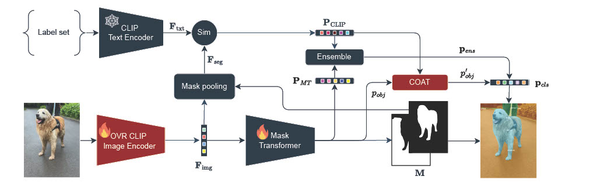
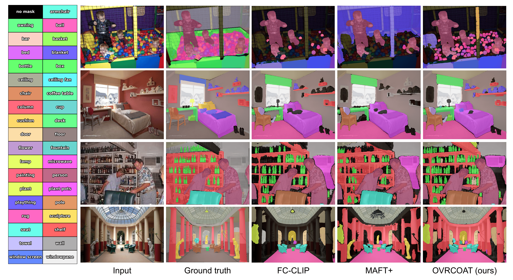

<div align="center">

# Mitigating Objectness Bias and Region-to-Text Misalignment for Open-Vocabulary Panoptic Segmentation [CVPR, 2026]

[Nikolay Kormushev](https://www.linkedin.com/in/kormushev/), [Josip Šarić](https://jsaric.github.io/), and [Matej Kristan](https://www.vicos.si/people/matej_kristan/)

Faculty of Computer and Information Science, University of Ljubljana

[[`Preprint`](https://arxiv.org/abs/2411.17576)]  [[`Project page`](https://jovanavidenovic.github.io/dam-4-sam/) ]

</div>

---


## Abstract
Open-vocabulary panoptic segmentation remains hindered by two coupled issues: (i) mask selection bias, where objectness heads trained on closed vocabularies suppress masks of categories not observed in training, and (ii) limited regional understanding in vision–language models such as CLIP, which were optimized for global image classification rather than localized segmentation. We introduce OVRCOAT, a simple, modular framework that tackles both. First, a CLIP-conditioned objectness adjustment (COAT) updates background/foreground probabilities, preserving high-quality masks for out-of-vocabulary objects. Second, an open-vocabulary mask-to-text refinement (OVR) strengthens CLIP’s region-level alignment to improve classification of both seen and unseen classes with markedly lower memory cost than prior fine-tuning schemes. The two components combine to jointly improve objectness estimation and mask recognition, yielding consistent panoptic gains. Despite its simplicity, OVRCOAT sets a new state of the art on ADE20K (+5.5% PQ) and delivers clear gains on Mapillary Vistas and Cityscapes (+7.1% and +3% PQ, respectively). See the [preprint](https://arxiv.org/abs/2411.17576) for more details.


<div align="center">
  
</div><br/>

## Installation

See [installation instructions](INSTALL.md).

## Getting Started

See [Preparing Datasets for OVRCOAT](datasets/README.md).

See [Getting Started with OVRCOAT](GETTING_STARTED.md).

## Model weights
Download [OVRCOAT](https://drive.google.com/file/d/1raLz9TybKGxMCsWVjjdoBnbraUXDgmQ0/view?usp=drive_link)

## Qalitative results

<div align="center">
  
</div><br/>

## Quantitative results
| Method | ADE20k PQ | ADE20k SQ | ADE20k RQ | Mapillary PQ | Mapillary SQ | Mapillary RQ | Cityscapes PQ | Cityscapes SQ | Cityscapes RQ | COCO PQ | COCO SQ | COCO RQ |
|--------|-----------|-----------|-----------|--------------|--------------|--------------|---------------|---------------|---------------|---------|---------|---------|
| MaskCLIP | 15.1 | 70.5 | 19.2 | - | - | - | - | - | - | - | - | - |
| FreeSeg | 16.3 | 71.8 | 21.6 | - | - | - | - | - | - | - | - | - |
| OPSNet | 19.0 | 52.4 | 23.0 | - | - | - | 41.5 | 67.5 | 50.0 | 52.4 | 83.5 | 62.1 |
| ODISE | 23.4 | **78.1** | 28.3 | 14.2 | 61.0 | 17.2 | 23.9 | 75.3 | 29.0 | **55.4** | - | - |
| FC-CLIP | 26.8 | 71.2 | 32.3 | 18.3 | 56.0 | 23.1 | 44.0 | 75.4 | 53.6 | 54.4 | - | - |
| MAFT+pan | 27.1 | 73.5 | 32.9 | 15.7 | 55.5 | 19.8 | 38.3 | 70.2 | 46.9 | 50.3 | 82.2 | 60.3 |
| **OVRCOAT (Ours)** | **28.6** (+1.5) | 77.3 (-0.8) | **34.7** (+1.8) | **19.6** (+1.3) | **65.7** (+4.7) | **24.8** (+1.7) | **45.3** (+1.3) | **78.7** (+3.3) | **55.6** (+2.0) | 54.6 | 82.9 | 65.1 |


## Citing OVRCOAT
If you use OVRCOAT in your research, please use the following BibTeX entry.

```BibTeX
@inproceedings{ovrcoat,
  title={Mitigating Objectness Bias and Region-to-Text Misalignment for Open-Vocabulary Panoptic Segmentation},
  author={Nikolay Kormushev and Josip Šarić and Matej Kristan},
  booktitle={Proceedings of the IEEE/CVF Conference on Computer Vision and Pattern Recognition (CVPR)},
  year={2026},
}
```

## Acknowledgement

[FC-CLIP](https://github.com/bytedance/fc-clip)
[Mask2Former](https://github.com/facebookresearch/Mask2Former)
