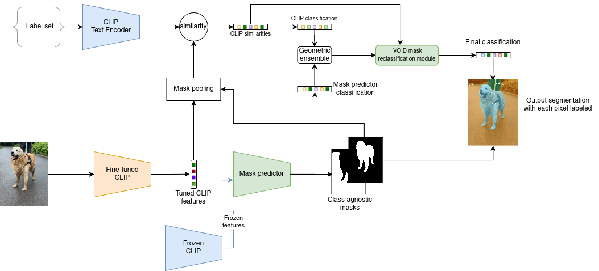

# Re-CLIP: Boosting Open-Vocabulary Panoptic Segmentation via Reclassification

This repo contains the code for my master thesis in Open-Vocabulary Panoptic Segmentation

  

 

*Re-CLIP* is an *FC-CLIP* based universal model for open-vocabulary image segmentation problems. With it's novel background/VOID
mask reclassification model and it's fine-tunning of CLIP it improves performance from 26.8 to 27.94 PQ.

## Installation

See [installation instructions](INSTALL.md).

## Getting Started

See [Preparing Datasets for Re-CLIP](datasets/README.md).

See [Getting Started with  Re-CLIP](GETTING_STARTED.md).

## Acknowledgement

[FC-CLIP](https://github.com/bytedance/fc-clip)
[Mask2Former](https://github.com/facebookresearch/Mask2Former)
